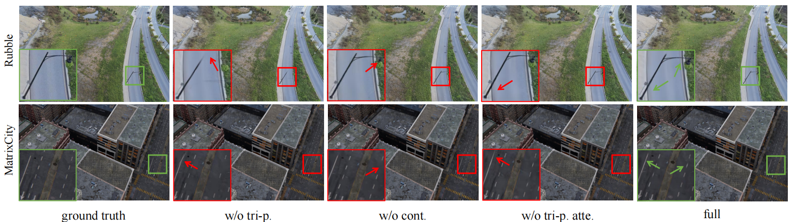

<p align="center">
<h1 align="center"><strong>SplatCo: Structure-View Collaborative Gaussian Splatting for Detail-Preserving Large-Scale Unbounded Scene Rendering</strong></h1>

## Overview

In this work, we propose Structure–View Collaborative Gaussian Splatting (SplatCo), a unified framework for high-fidelity reconstruction and rendering of large-scale outdoor scenes. Unlike prior approaches that separately address geometry representation or view consistency, SplatCo integrates both global structure modeling and multi-view coherence into a single, jointly optimized system. First, we incorporate multi-scale contextual information into a global tri-plane backbone using a three-level compensation mechanism, which aligns coarse scene layout with detailed local geometry and texture. Second, to maintain consistency across viewpoints, we synchronize gradient updates across overlapping views, ensuring coherent Gaussian positioning and appearance. Third, we introduce a visibility-aware optimization process that densifies sparsely observed regions while removing overfitted or inconsistent Gaussians based on structural consistency. By combining these components in a unified training and inference pipeline, SplatCo enables robust generalization and fine-detail reconstruction across complex, large-scale environments.

<p align="center">

</p>

## Dataset

We performe experiments on eight scenes from four public datasets from the Mega-NeRF, MatrixCity, 3D Gaussian Splatting and WHU dataset.

Mill-19 dataset:
Please download the data from the [Mega-NeRF](https://github.com/cmusatyalab/mega-nerf)

MatrixCity-Aerial dataset:
Please download the data from the [MatrixCity](https://city-super.github.io/matrixcity/)

Tanks & Temples dataset:
Please download the data from the [3D Gaussian Splatting](https://repo-sam.inria.fr/fungraph/3d-gaussian-splatting/)

WHU dataset:
Please download the data from the [WHU dataset](http://gpcv.whu.edu.cn/data/)

We performe experiments on five self-collected scenes(SCUT Campus and plateau regions).

Please contact us:

Haihong Xiao and Jianan Zou: auhhxiao@mail.scut.edu.cn; 202130450216@mail.scut.edu.cn

Prof. Wenxiong Kang: auwxkang@scut.edu.cn

## Installation

We tested on a server configured with Ubuntu 20.04, cuda 11.8 and gcc 9.4.0. Other similar configurations should also work, but we have not verified each one individually.

1. Clone this repo:

```
git clone https://github.com/SCUT-BIP-Lab/SplatCo.git
cd SplatCo
unzip ./submoudles.zip
```

2. Install dependencies

```
conda env create -f environment.yml
conda activate splatco
```

3、Data preparation

First, create a ```data/``` folder inside the project path by 

```
mkdir data
```

The data structure will be organised as follows:

```
data/
├── dataset_name
│   ├── scene1/
│   │   ├── images
│   │   │   ├── IMG_0.jpg
│   │   │   ├── IMG_1.jpg
│   │   │   ├── ...
│   │   ├── sparse/
│   │       └──0/
│   ├── scene2/
│   │   ├── images
│   │   │   ├── IMG_0.jpg
│   │   │   ├── IMG_1.jpg
│   │   │   ├── ...
│   │   ├── sparse/
│   │       └──0/
...
```

## Quick Start

You can quickly train the dataset using the following command:

```
conda activate splatco
cd SplatCo
python train.py -s ./data/dataset/scene/  -m ./output/dataset/scene/ --mv 4 --num_channels 15 --plane_size 2800 --no_downsample --port 6555 --contractor --bbox_scale 0.3 --voxel_size 0 --update_init_factor 16 --appearance_dim 0 
```

## Training and Evaluation

You can run other scene datasets by either modifying or executing the following command. For specific file modifications, please contact us [Haihong Xiao](auhhxiao@mail.scut.edu.cn) and [Jianan Zou](202130450216@mail.scut.edu.cn), and we will provide assistance.

```
conda activate splatco
cd SplatCo
python train.py -s <path to COLMAP or NeRF Synthetic dataset>　--eval --mv 4 --num_channels 15 --plane_size 2800 --no_downsample --port 6555 --contractor --bbox_scale 0.3 --voxel_size 0 --update_init_factor 16 --appearance_dim 0 
python render.py -m <path to trained model>
python metrics.py -m <path to trained model>
```

## Results

Visual comparisons on Mill-19 and MatrixCity dataset:

<p align="center">

</p>

Visual comparisons on tandt outdoor scenes:

<p align="center">

</p>

Visual comparisons on qualitative comparison of ablation study on cross-structure collaborated module:

<p align="center">

</p>

## Acknowledgements

Our code follows several awesome repositories. We appreciate them for making their codes available to public.

[Mega-NeRF](https://github.com/cmusatyalab/mega-nerf)

[Switch-NeRF](https://github.com/MiZhenxing/Switch-NeRF)

[3DGS](https://github.com/graphdeco-inria/gaussian-splatting) 

[GaMeS](https://github.com/waczjoan/gaussian-mesh-splatting) 

[Compact3DGS](https://github.com/maincold2/Compact-3DGS) 

[Scaffold-GS](https://github.com/city-super/Scaffold-GS)

### 📢 Sincere Appreciation and Apology Regarding MVGS

Our cross-view assisted training strategy builds on MVGS, and we gratefully acknowledge this inspiration. The earlier omission of this attribution in our preprint has now been fully corrected in the latest arXiv revision.

[MVGS](https://github.com/xiaobiaodu/mvgs)

## Star History

[](https://www.star-history.com/#SCUT-BIP-Lab/SplatCo&Date)
